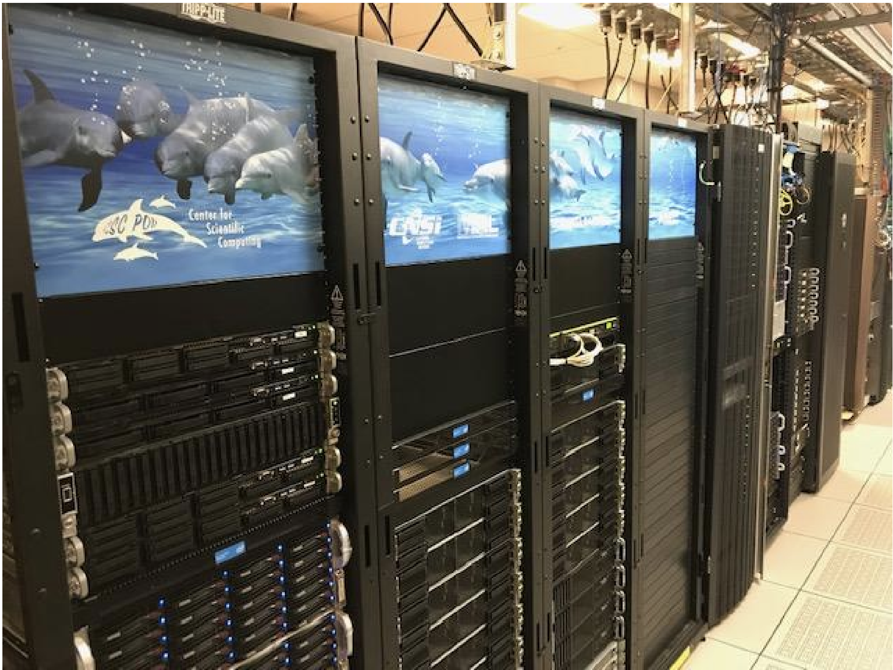

High Performance Computing with R @ UC Santa Barbara
========================================================
author: Mary Donovan
date: April 9, 2019
autosize: true

Outline
========================================================

- What is high performance computing?
- Overview of UCSB resources
- Accessing pod and knot
- Running jobs
- Some specifics for R
- An example
- Give it a try

What is high performance computing?
========================================================
- Multiple computer notes, with fast interconnect, where each node consists of many CPU cores 
(aka "cluster")
- Allows multiple users to run computations simulataneously  
- Allows single users to access multiple cores and multiple nodes for parallel jobs  
- Can have high end GPUs (large amounts of memory)  

What is high performance computing?
========================================================
Why and when to use HPC? 
- Designed for when computational problems are either too large or take too long for standard computers
- When HPC might not be your solution:
  - There’s lots of interaction with the program, and single runs (You need a really powerful desktop)
  - You need 1,000 nodes, but only once every 3 months (Cloud resources may be your solution)
  - You need 1,000 nodes, all the time (You need your own cluster)
  - You work with sensitive data

  

What is high performance computing?
========================================================
- Serial vs. Parallel computing


Overview of UCSB resources
========================================================
- Enterprise Technology Services, Center for Scientific Computing 
  - pod cluster (2018), knot cluster (2011), braid (condo clusters)
- Extreme Science and Engineering Discovery Environment (XSEDE)
- Triton Shared Computing Cluster (TSCC) at San Diego Supercomputing Center (SDSC)

(more on CSC?)

Overview of UCSB resources
========================================================

***
- Campus available cluster Knot (CentOS/RH 6):  
110 node, ~1400 core system  
4 ‘fat nodes’(1TB RAM)  
GPU nodes (12 M2050’s) (now too old)  

- Campus available cluster Pod (CentOS/RH7):  
70 node, ~2600 core system  
4 ‘fat nodes’(1TB RAM)  
GPU nodes (3) (Quad NVIDIA V100/32 GB with NVLINK)  
GPU Development node (P100, 1080Ti, Titan V)  

- Condo clusters: (PI’s buy compute nodes)  
Guild (60 nodes)  
Braid (120 nodes, also has GPUs)  

Accessing pod and knot
========================================================
- accounts  
Request access: http://csc.cnsi.ucsb.edu/acct
- login node versus compute nodes - don't run stuff on the login node!  
- talk about storage systems?  
- command line interface  

Some basic commands
========================================================
  - pwd
  - cd
  - ls
  - mkdir
  - mv
  - nano

Running jobs
========================================================
  - scheduler
  - queues

Some specifics for R
========================================================
  - versions
  - libraries

An example
========================================================
1. login to cluster
2. transfer input files
3. create a submission script
4. submit your job and check the status
5. scheduler runs computation on compute nodes
6. transfer output files 

Give it a try
========================================================
1. login to cluster 
  
```
ssh username@pod.cnsi.ucsb.edu
```

Give it a try
========================================================
2. transfer input files  
  
```
scp file.txt user@pod.cnsi.ucsb.edu: file_copy.txt
```

Lets also make a quick R code to run
  
```
echo “data <- data.frame(x=seq(1:10),y=seq(1:10)); write.csv(data,”testcsv.csv”,row.names=F)“ > myscript.R

```


Give it a try
========================================================
3. create a submission script  
  
```
nano submit.job
#!/bin/bash -l
#Serial (1 core on one node) job...
#SBATCH --nodes=1 --ntasks-per-node=1

cd $SLURM_SUBMIT_DIR
module load R
Rscript myscript.R
```

Give it a try
========================================================
4. submit your job and check the status  
  
```
sbatch submit.job
qstat -u mdono
```

Give it a try
========================================================
5. wait for the magic  
<iframe src="https://giphy.com/embed/hCiQVo1dzVwPu" width="480" height="288" frameBorder="0" class="giphy-embed" allowFullScreen></iframe><p><a href="https://giphy.com/gifs/mrw-waiting-hCiQVo1dzVwPu">via GIPHY</a></p>

Give it a try
========================================================
6. transfer output files  
  
```
scp file.txt user@pod.cnsi.ucsb.edu: file_copy.txt
```

